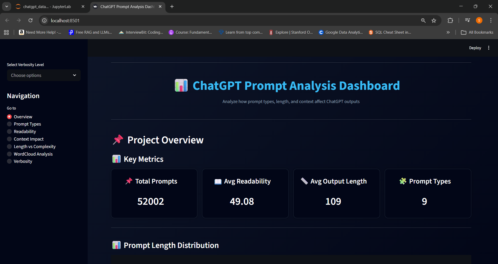
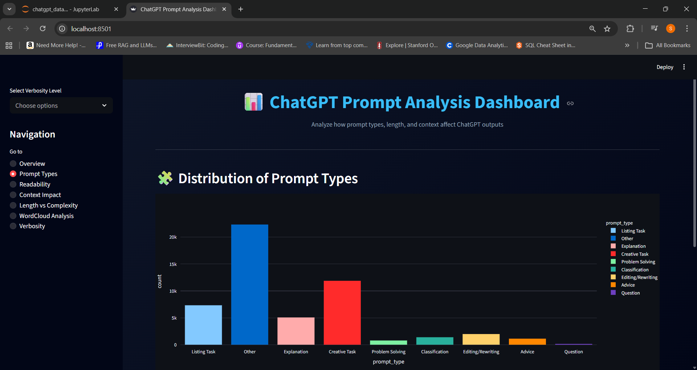
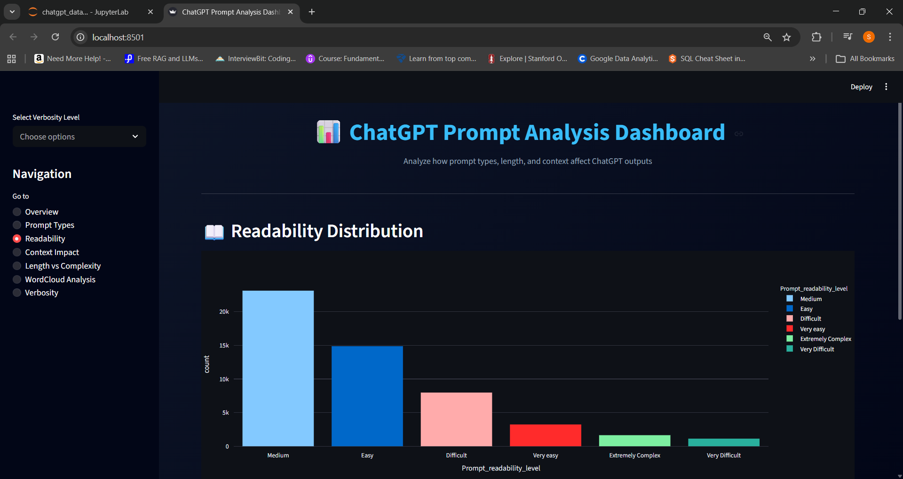
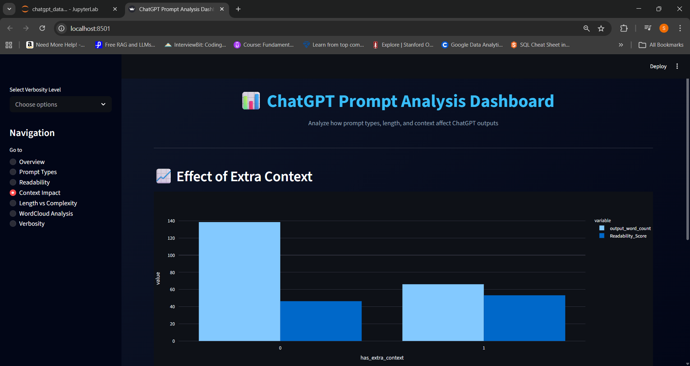
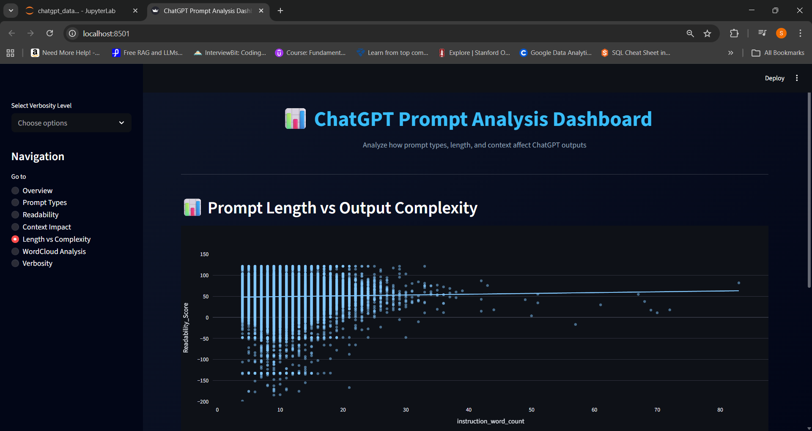
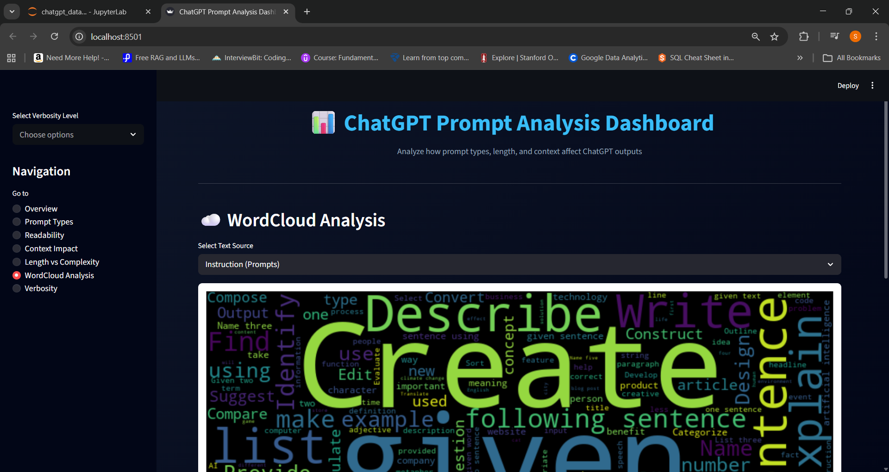
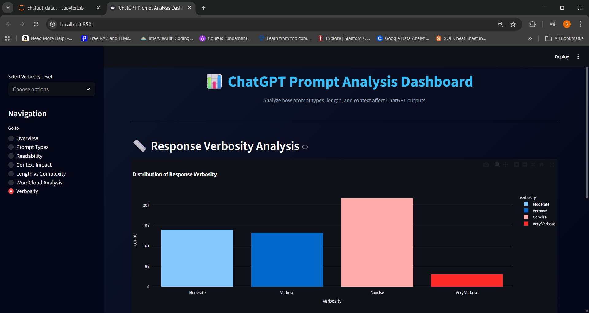

# 📊 ChatGPT Prompt Analysis Dashboard

An interactive data analysis dashboard built using **Streamlit** to explore how different prompt characteristics influence ChatGPT responses.

---

## 🚀 Project Overview

This project analyzes a large dataset of GPT-generated responses to understand:

* 📏 How prompt length affects output complexity
* 📖 Readability patterns in responses
* 🧩 Distribution of prompt types
* 📈 Impact of additional context
* ☁️ Common keywords using WordCloud
* 📊 Verbosity patterns in responses

---

## 🌐 Live Dashboard

🚀 **View the deployed app here:**
👉 https://your-app.streamlit.app

*(Replace with your actual deployed link)*

---

## 📂 Dataset

* Source: Hugging Face (`vicgalle/alpaca-gpt4`)
* Contains instruction-following data generated using GPT-4
* Preprocessed and feature-engineered for dashboard analysis

---

## 🛠️ Tech Stack

* Python
* Streamlit
* Pandas
* Plotly
* NumPy
* WordCloud
* Matplotlib

---

## 📊 Features

### 🔹 Interactive Dashboard Sections

* Overview with KPIs and insights
* Prompt Type Distribution
* Readability Analysis
* Context Impact Analysis
* Prompt Length vs Complexity
* WordCloud Visualization
* Verbosity Analysis

### 🔹 Advanced Analysis

* Correlation & regression analysis
* Feature engineering (prompt types, verbosity, readability levels)
* Interactive filtering

---

## 📈 Key Insights

* Creative prompts dominate ChatGPT usage
* Most responses fall under **medium readability**
* Adding context:

  * 🔽 Reduces output length
  * 🔼 Improves readability
* Prompt length has **very weak correlation** with readability
* Response quality depends more on **clarity than length**

---

## 📸 Dashboard Screenshots

### 🏠 Overview



### 📊 Prompt Type Analysis



### 📖 Readability Analysis



### 📖 Context Impact



### 📈 Length vs Complexity



### ☁️ WordCloud



### 📏 Verbosity Analysis



---

## ⚙️ Installation & Setup

### 1. Clone the repository

```bash
git clone https://github.com/your-username/chatgpt-prompt-analysis.git
cd chatgpt-prompt-analysis
```

### 2. Install dependencies

```bash
pip install -r requirements.txt
```

### 3. Run the app

```bash
streamlit run app.py
```

---


## 👨‍💻 Author

**Shobhit Sharma**
Aspiring Data Analyst

---

## ⭐ If you like this project

Give it a ⭐ on GitHub!
